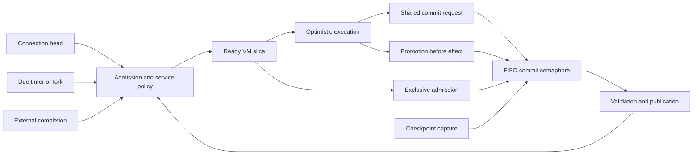

# Cooperative transaction scheduling for Barn

Design date: 2026-09-18. Source baseline: `e86ecd0` on
`fix/mongoose-workload`. Status: proposed architecture, not a runtime patch.
This document supersedes the policy recommendation in
`../reports/barn-gate-scheduling-decision-20260918.md`; the source evidence and
negative findings in that report remain useful.

## Decision

Keep optimistic MVCC. Schedule MOO execution at its existing cooperative
boundaries. Make transaction admission and commit-gate admission explicit,
using weighted service accounting for runnable work and a **FIFO task-fair
reader/writer semaphore** for gate requests. Use serial irrevocability as the
initial protection for nonrestartable slices and external effects. Do not
replace conflict validation with scheduling priority.

This is a composition of established mechanisms, not a new concurrency-control
algorithm. The semaphore's shared users are **ordinary writing commits**, not
database readers. Its exclusive users are nonrestartable slices, escalation,
effect promotion, and checkpoint capture. Confusing these roles produces an
incorrect design even if the RW-lock algorithm itself is correct.

Retain the existing **execution lease before gate acquisition** order. Removing
leases from waiting continuations is a later optimization, conditional on
measured GC/worker pressure; it is not part of the selected first design.

The first implementation targets dispatch delay and explicit gate ownership without claiming
global serializability, fine-grained irrevocability, or hard latency bounds.
The target architecture admits all top-level MOO execution through one policy;
converting bypass paths is a separate, explicit integration milestone.

## Questions answered

| Question | Answer |
| --- | --- |
| Is cooperative execution with transactions explored? | Yes. STM inevitability and contention management address effect safety and progress; CoroBase combines coroutines with MVCC; Orleans combines cooperative turns with transactions. Their assumptions differ. |
| Why can Barn background work wait despite runnable Go goroutines? | Runnable MOO work can be absent from the selected ready snapshot, delayed by batch joining, or blocked on the global commit gate. Go scheduling does not select a different MOO task from these queues. |
| Why does Toast differ? | The inspected Toast source selects one queue/task, charges that queue, reinserts it, and returns to the server loop. It does not use Barn's concurrent MVCC commit protocol. |
| Is a saved VM inherently irrevocable? | No. Barn currently lacks a complete rollback contract for resumed execution. Persistence snapshots exist, but copying mutable identities, lifecycle guards, and task effects is not transaction rollback. |
| Must the gate cover a whole task? | It currently covers a nonrestartable slice, or the tail after an irreversible boundary. That exclusion remains until a different isolation protocol is implemented. A mutex wrapper cannot shorten it safely. |
| Can unrelated transactions continue? | Optimistic execution and snapshot reads can continue under current rules; ordinary writing commits wait during exclusive ownership. Allowing nonconflicting commits requires read protection and publication changes, not just a better queue. |
| Why not use the STM paper's priorities directly? | Its read instrumentation, ownership records, validation rules, and irrevocability protocol are part of its algorithm. Barn does not acquire those guarantees by importing a priority formula. |
| Is the gate part of scheduling? | Yes: admission knows exclusive demand; gate waiters count against bounded in-flight capacity; ordinary writing commits, promotions and checkpoint capture share one explicit FIFO policy and ownership contract. Initially retain the existing VM lease while waiting. |
| What is tunable? | Principal weights, bounded interactive preference inside each principal, in-flight limits, and diagnostic latency objectives. Gate FIFO and ownership safety are not tunable. |
| What is smarter than Toast? | Finer service measurement, explicit commit contention, prompt completion wakeups, bounded speculation, and later measured admission control. No prediction or reinforcement learning is required. |
| Is it buildable? | Yes as an incremental design using queues, opaque ownership tokens, existing VM boundaries and StoreTxn. It is not yet implemented or performance-validated. |

## Research and what transfers

Detailed findings and source links live in
[transaction contention research](../reports/research-barn-transaction-contention.md)
and [cooperative MVCC research](../reports/research-barn-cooperative-mvcc.md).

1. Spear et al., ICPP 2008, *Implementing and Exploiting Inevitability in
   Software Transactional Memory*: irreversible operations need a transaction
   that cannot subsequently lose. Protecting reads and validating before the
   effect are essential. Serial exclusion is the conservative variant;
   concurrent inevitability needs additional conflict instrumentation.
   [Primary source](https://research.ibm.com/publications/implementing-and-exploiting-inevitability-in-software-transactional-memory).
2. Spear et al., PPoPP 2009, *A Comprehensive Strategy for Contention Management
   in STM*, especially sections 3–4: combine conflict information with priority
   rather than blocking unrelated transactions indiscriminately. Section 3.4
   limits the progress claims of the combined heuristics. Do not present its
   abstract as a starvation-freedom proof for Barn.
   [Paper](https://www.cs.rochester.edu/u/scott/papers/2009_PPoPP_CM.pdf).
3. *Deadline-Aware Scheduling for STM*, DSN 2011: adaptive execution modes use
   measured execution distributions. Its assumptions about rare irrevocable
   work do not describe arbitrary queued Barn resumptions; its deadline
   calculation is not a Barn response-time bound.
   [Paper](https://who.paris.inria.fr/Gilles.Muller/papers/dsn2011.pdf).
4. Waldspurger and Weihl, *Stride Scheduling*, 1995, sections 2.2–2.4:
   proportional service and accounting for variable nonpreemptive run lengths.
   Barn's proposed parallel admission is an adaptation, not a claim to the
   original uniprocessor error bound.
   [Paper](https://people.eecs.berkeley.edu/~prabal/teaching/resources/eecs582/waldspurger95stride.pdf).
5. Brandenburg and Anderson, ECRTS 2009, *Reader-Writer Synchronization*,
   introduction and section 3: distinguishes task-fair FIFO locks from
   phase-fair locks. Choose task fairness for a simple cancellation-capable
   blocking semaphore. Do not copy a spinning implementation or real-time
   blocking bounds into Go. Phase fairness remains a possible measured
   alternative if short shared commits suffer behind many exclusive holders.
   [Extended paper](https://people.mpi-sws.org/~bbb/papers/pdf/ecrts09-long.pdf).

The closest papers supply different pieces. None supplies a complete MOO
runtime, its effect semantics, and its garbage collector. The recommendation
is deliberately smaller than replacing Barn's storage engine with an STM.

## Source constraints and corrections

These are source observations at the baseline, not new workload measurements.

| Source | Evidence and implication |
| --- | --- |
| `engine/runtime.go:465` | `Ready(...)` followed by `runReadyTasks(readyTasks)` drains a selected snapshot. Persistent ready queues must replace snapshot-wide execution planning. |
| `engine/internal/scheduler/scheduler.go:149` | `Plan` isolates nonretryable tasks; `Run` joins a batch. Production fork/saved-VM scheduling is mostly solo, so adding workers alone does not address this. |
| `server/input_processor.go:31` | Separate connection goroutines bypass background policy. Whole-server fairness requires their admission, not just sorting background tasks. |
| `engine/task_runtime.go:133` | `!retryState.canRetry` takes exclusive gate before execution. This is an implementation restriction, not an MVCC theorem. |
| `engine/task_runtime.go:199` | Promotion takes exclusive ownership then `CommitAndRenewCarryingReads`. Keep validation before effects and retain ownership afterward. |
| `db/store/store_txn.go:2636` | Write-free `Commit()` returns before gate and validation. Do not claim all readers are blocked or all successful commits validate reads. |
| `db/store/store_snapshot.go:71` | Checkpoint capture holds the exclusive gate over the object walk. Disk writing is a different phase. |
| `engine/runtime.go:193` | VM starts acquire `VMStartMu`, then register physical execution under runtime mutex. A gate grant must not precede a blocking wait on this barrier. |
| `engine/waif_lifecycle.go:232` | Sweep holds `SweepMu` then `VMStartMu`, checks quiescence, and runs hooks. Root ownership must survive native waits and nested calls. |
| `vm/persistence.go:17` | Yielded VM snapshot and restore already exist. They are reusable representation work, not a rollback proof. Restore also registers recycle guards. |
| `types/waif.go:93`, `vm/op_property.go:271` | WAIF property updates mutate shared payloads. Shallow copies retain those identities. The VM assignment comment claiming COW is stale. |
| `engine/eval.go:103` | Direct eval uses `DirectTxn()` and its own VM loop. It cannot be assumed to participate in `runTaskSlice` admission or rollback. |
| `engine/call_verb.go` | Standalone hooks and inherited/sweep-owned calls have separate ownership paths. Classify these individually; never infer ownership from a repeated task ID. |

The earlier captured trace
`{"queue_wait":10078709500,"ready_to_vm":10078709500}` describes pre-dispatch
delay. It does not measure an additional ten-second gate wait. Both mechanisms
belong in the design without relabeling that observation.

## Architecture and ownership



**Admission policy** owns runnable membership, stable sequence numbers,
principal accounting, connection ordering, and bounded in-flight work. It
never holds its mutex while running MOO, awaiting a gate, or invoking GC.

**Commit semaphore** owns shared/exclusive requests, grant generations,
cancellation and release. It knows request metadata and reasons, not VM
internals. It replaces every raw production `commitGate` access.

**Execution lifecycle** owns VM roots and execution leases. Admission asks it
to register execution; the gate does not discover roots or run the collector.

**Transaction attempt** owns StoreTxn, retry state, pending effects, and the
capability for an exclusive grant. Nested synchronous execution borrows the
same attempt capability; only its owner releases it.

Keep these as small interfaces within the current engine/store boundaries.
Do not introduce a generic scheduling framework or plugin policy language.

Proposed contract sketch (names are illustrative, not existing APIs):

```go
// Runtime policy: all root-bearing arguments are registered before waiting.
Admit(ctx, SliceRequest) (Reservation, error)
Reservation.Cancel() // releases only unstarted admission
Reservation.Finish(ServiceRecord)

// Store gate: blocking acquire with explicit cancellation and owner identity.
Acquire(ctx, mode, RequestMetadata) (Grant, error)
TryAcquire(mode, RequestMetadata) (Grant, bool) // respects queued predecessors
Grant.Release() // owner-only, exactly once

// Exemption is checked ownership, replacing an unqualified boolean assertion.
StoreTxn.BindExclusiveGrant(Grant, AttemptIdentity) error
```

The store verifies mode, active generation, store identity and owning attempt
when granting commit exemption. Checkpoint grants are not silently usable as
arbitrary transaction grants; inherited hook execution needs an explicit
maintenance/attempt capability. An error path must retain an owned grant until
its owner cleanup runs, even when the request's context has been cancelled.

## Runnable policy

Use one stable principal ledger, with FIFO input and background subqueues.
Attribute **input to its connection/player queue**, and **forked/resumed
background work to the activation programmer**. These are different Toast
paths: `tasks.cc:1171` uses the supplied connection task queue;
`enqueue_waiting:1189` and `resume_task:1327` use the background activation's
programmer. Input identity is available before parsing or finding a verb;
charging all input to the called verb's programmer would collapse unrelated
players executing wizard-owned verbs into one scheduling principal.

Freeze attribution for the slice. A background continuation may consequently
use a different principal from its originating input; keep lineage distinct
from this fairness identity. Server-owned independent hooks use an explicit
system principal; inherited callbacks stay in the caller's reservation.
Execution inside called verbs does not continuously move cost between
principals. None of this changes MOO permissions or programmer identity.

Pre-auth connections are separate child queues under a shared anonymous
budget. The aggregate weight does not grow with connection count, but is
**not a concurrency cap of one**. After authentication, future input uses the
player ledger. Existing debt remains with the principal that incurred it.
Forks do not inherit an unlimited interactive entitlement.

At each worker completion, newly due timer, input head, or external completion:

1. Publish readiness once, using a stable event sequence; keep unstarted work
   visible and cancellable. An event is not a claim on execution.
2. Among eligible principals select minimum normalized service, rotating ties.
   For a single active slice, charge `elapsed execution occupancy / weight`.
   Exclude gate waiting and external suspension; include failed speculative
   execution. Charge synchronous native I/O while it retains the executor as
   occupancy, and separately label it as native wait. Record reserved-slot
   gate wait in its own ledger: it is capacity consumed, even though excluded
   from execution service. This is occupancy, not measured CPU time. Use a
   positive clock-granularity floor for nonempty execution, and rotate ties by
   last-dispatch sequence, so zero-duration clock samples cannot mint service.
3. Within that principal, choose input versus background using separate
   weighted service ledgers with positive weights (initial experimental ratio
   3:1). A background completion is not automatically interactive. Keep input
   order on each connection and defined FIFO order within each subqueue.
4. Keep one active input slice per connection, as ordering already requires.
   Principal identity does not imply mutual exclusion. Set a configurable
   per-principal cap, initially the global in-flight limit, not one. The global
   limit bounds all parked native continuations as well as running work; a
   lower per-principal parked-native cap may be added as admission control,
   never by refusing an already-running task permission to finish. Background
   execution initially retains its existing solo-versus-retry-safe eligibility.
   Workers have no long private queues.
5. At dispatch reserve positive estimated execution service in the principal
   and class ledgers; at completion replace that provisional charge with actual
   service. This prevents multiple in-flight slices from repeatedly selecting
   an apparently uncharged principal. Preserve debt while a principal is blocked;
   on reactivation clamp credit to the current active minimum rather than
   resetting service to zero. Never discard debt while descendants remain.
6. Start another selection instead of draining an old plan. Prompt event
   notification replaces dependence on the 10ms poll for completed helpers;
   the timer remains a fallback and a source of due-time notifications.

The normalized-service rule is an engineering adaptation of proportional-share
scheduling. There is no imported theorem for unequal nonpreemptive slices,
parallel workers, blocked principals, and these class subqueues. Its progress
argument assumes finite eligible populations, positive weights, finite slices,
and fair servicing of completion events. Validate service shares under load.

Let each ledger contain settled service `V` and provisional service `R`.
Select minimum `V + R`; dispatch reserves `estimate / weight`; completion
subtracts that exact reservation and adds `actual / dispatch_weight` to `V`.
Weight changes affect future dispatches, not an in-flight charge. Estimate
uses a bounded EWMA by slice kind (initial experiment: 1ms, alpha 1/8, clamped
to 1us–100ms); these are tuning starting points, not literature constants.
Cancellation before execution removes the reservation without charging work.

Retain a monotonic virtual-service watermark when all queues sleep. On
reactivation, set `V = max(saved_V, watermark)` without modifying outstanding
`R`; update the watermark from settled active service without decreasing it.
Use the same rule within class subqueues. This is a bounded-credit adaptation,
not Stride's exact `remain` algorithm or a theorem for parallel execution.
The in-flight cap bounds the number of unsettled estimates, not their possible
error when a synchronous call stalls. Shares apply among eligible queues.

A slice parked inside a builtin still occupies admission capacity. Nested
synchronous calls inherit the reservation rather than queuing behind their
parent. True MOO suspension releases it. A native operation that needs another
MOO task must materialize a real suspension; otherwise a finite worker cap can
deadlock on same-pool dependencies. Audit such callers before global admission.

## Commit admission: exact policy

Assign increasing tickets to gate requests. Modes are `SharedCommit` and
`Exclusive(reason)`. Reasons distinguish `Nonrestartable`, `EffectPromotion`,
`RetryEscalation`, and `Checkpoint`; they do not change FIFO rank.

When idle, admit the oldest request. If shared, admit the consecutive shared
prefix concurrently. New shared requests may join only when no earlier
exclusive request intervenes. If exclusive, admit exactly one. Do not let
foreground effects repeatedly overtake an older background or checkpoint
request. Do not hold shared access while upgrading to exclusive: ordinary
execution has no shared gate hold, and promotion submits a fresh request.

This is task-fair RW admission, not phase fairness, weighted gate ownership, or
a second strict-priority scheduler. Gate tuning must not silently change it.
The separate gate-hold ledger diagnoses monopoly; it is not added to execution
occupancy to double-charge overlapping time. If exclusive service dominates,
shorten its necessity/duration before adding another policy.

Known-exclusive work initially uses the current resource order: acquire its
physical execution lease, then request the gate, then begin its snapshot.
There is no gate offer waiting for an executor that is occupied by a younger
gate waiter: every requester already has its executing goroutine. Connection
lanes are those executors before whole-server admission; afterwards an
admission reservation limits their population. They need not be moved onto
the background worker channel merely to share policy.

This keeps parked VMs rooted and avoids introducing a gate→VM-start-barrier
dependency. It retains the existing cost: waiters occupy in-flight capacity
and can delay GC. Record that cost instead of claiming it has been removed.
No new maintenance drain protocol is required for this migration.

The Go project already supplies this queueing pattern in
[`x/sync/semaphore`](https://raw.githubusercontent.com/golang/sync/master/semaphore/semaphore.go):
`notifyWaiters` deliberately refuses to skip a large head request for smaller
ones, and `Acquire` handles cancellation racing with notification. A wrapper
can model shared commits as one token and exclusive access as all tokens,
with a checked capacity covering the maximum concurrent shared participants.
Prefer that implementation pattern over inventing a priority arbiter. Pin a
compatible module version if used; the inspected source URL tracks `master`.
Its BSD-style license is identified in the file header. No code was copied.

Go's current [`RWMutex` contract](https://pkg.go.dev/sync#RWMutex) already blocks
new readers behind a waiting writer. Therefore the gate change is justified
by cancellation, attribution, ownership and explicit per-request ordering,
not evidence that the current mutex permits unlimited reader barging. Neither
that contract nor this research proves a measured Barn gate-starvation bug.
The measured pre-dispatch delay remains the reason to fix selection first.

At a mid-builtin promotion, retain the existing physical lease and Go stack.
Wait for the ticket without holding store/slot mutexes. After claim, validate
and renew before invoking the effect. Validation failure may replay only an
actually restartable attempt before any irreversible action. Gate contention
alone is not a reason to replay an expensive prefix.

On a genuine validation loss, **retain the same exclusive capability across
the replay**, matching current escalation behavior. Releasing and rejoining
the tail would permit repeated validation losses under continuous writes.
Once replay begins on a fresh snapshot under ownership, ordinary commit-based
writers cannot cause another loss. This is at most one conflict replay for
those writers, not a guarantee against uncoordinated direct mutations or other
runtime errors; its cost is re-executing that prefix under global exclusion.

## Ownership and cancellation state machine

```text
queued -> offered -> claimed -> released
   |         |
   +---------+-----> cancelled
claimed --cancel--> claimed(cancel_requested) --owner unwind--> released
```

All transitions are linearized under the semaphore mutex. A capability is an
unforgeable per-request reference containing generation/mode/owner attempt;
task ID is diagnostic metadata. `Release` consumes it exactly once. No timeout,
kill request, or cancellation callback may unlock a claimed holder.

Install cancellation registration before publishing the request, and check
cancelled state again at claim and before the first opcode. A kill racing just
after claim is owned by the normal execution unwind. The request capability
also identifies the execution reservation; legacy zero/reused task IDs must
not merge ownership. A second release logs an internal ERROR, increments an
invariant counter and performs no unlock; it must not panic during an unwind.
Cancel of a claimed request is idempotent. Cancellation does not return a
reservation or free VM state until the physical execution owner acknowledges
cleanup. Task claim and gate claim are separate: the selected design retains
the existing running-task state while that executor waits for the gate.
Unselected ready tasks remain visible and killable. Do not implement a second
queued-to-running transition after gate acquisition.

Nested execution borrows the same capability and StoreTxn exemption. It cannot
release, downgrade, or reacquire against itself. A callback requiring an
independent transaction must run after owner release, or be explicitly folded
into that transaction; task-ID equality is not authorization.

Carry the opaque attempt ownership through `TaskContext`, alongside StoreTxn,
and preserve it across commit/renew. `CallVerbInContext` borrows; standalone
`CallVerb` is independent unless an explicit parent ownership/context is
supplied; sweep contexts borrow only a maintenance capability when that later
mode exists. A synchronous callback needing the parent's protection must use
the same transaction context, not silently create a child transaction under
the same task ID. Classify every context constructor during integration.

Deferred `dump_database` runs after release of the original grant; it is still
an active, rooted invocation while waiting for its new checkpoint request.
Account for it accordingly. Never request checkpoint ownership while retaining
an exclusive task grant. Hook tasks need explicit borrowed or independent
ownership; they cannot queue synchronously behind their parent's capacity.

Anchor MOO execution budgets when execution begins, excluding admission and
gate waits using the existing wait-exclusion mechanism. Keep scheduler service
accounting separate from `seconds_left()` and tick quotas. Shutdown closes new
admission, cancels queued/unclaimed gate requests, signals claimed owners,
joins their normal cleanup, then publishes final roots. It cannot forcibly
release a holder stuck inside an irreversible operation.

Before returning a slot at suspend/completion, finish commit/discard, publish
the complete saved VM state, settle pending effects under the existing
semantics, and release exclusive ownership. Then release physical execution
ownership and allow deferred GC. Panic and cancellation unwind through the
same owner cleanup. Preserve the existing distinction between logical
TaskSuspended and a still-running native invocation.

## Safety envelope and integration obligations

The gate proof covers **participants**, not arbitrary direct store writes:

- No exclusive capability overlaps another exclusive or shared capability.
- Shared ordinary commits keep their existing validation and slot-lock rules.
- Promotion validates all prior reads before an external effect and does not
  permit an ordinary writing commit afterward until owner release.
- A retry never repeats a published irreversible effect.
- The scheduler never creates a new MOO-visible commit/yield boundary.
- A native continuation remains rooted until its owning invocation unwinds.

Do not claim this proves opacity or whole-server serializability. Read-only
early return, partial publication at current effect boundaries, direct views,
anonymous objects, and mutable WAIF payloads are distinct existing behaviors.

Before claiming complete admission coverage, inventory every top-level VM
entry (`runTaskSlice`, `Eval`, standalone `CallVerb`) and every live mutation.
Route independent top-level execution through admission; inherited and
sweep-owned hooks retain their ownership and cannot queue behind themselves.
Top-level direct mutation needs explicit exclusive participation or migration
to StoreTxn, with oracle verification of changed execution behavior. That
does not by itself make WAIF reads transactional or erase data races outside
StoreTxn. Wider speculative execution and replay remain disabled until those
paths have an explicit synchronization/rollback contract.

GC keeps `SweepMu -> VMStartMu` and its current fail-closed quiescence check.
A physically active gate waiter prevents a sweep rather than being skipped.
Never wait for active leases to drain while holding a resource they need.
The initial migration leaves sweep scheduling unchanged. Current sweep hooks
can use direct store mutation without gate participation (`gcRecycleContext`
and recycle-hook paths in `engine/waif_lifecycle.go`); they are an explicit
limit on the gate's isolation envelope, not an implicit part of its proof.
Inventory checkpoint/sweep overlap before claiming stronger coverage.

### Deferred alternative: admission without an execution lease

Do not implement this as part of the first fair-admission change. Consider it
only if measured gate wait materially pins GC or consumes execution capacity.
The earlier per-request executor reservation is rejected: it avoids inversion
but fills the worker pool with known-exclusive waiters. Fable proposes one
dedicated exclusive-start executor; any prototype must also prove what
happens when the previous invocation releases the gate but retains that
executor through completion hooks or a deferred checkpoint. Merely adding
one worker does not resolve arbitrary same-pool dependencies.

Such a prototype needs published roots, request-owned provisional leases,
atomic cancellation/claim, and no gate ownership before crossing VM-start
exclusion. Claim failure withdraws the provisional lease and re-triggers
deferred GC outside gate locks. It also needs the following maintenance
contract. These are acceptance constraints for a later experiment, not
prerequisites for the chosen lease-before-gate implementation.

An offer cannot block a sweep that is preventing that offer's VM start.
For **independent deferred maintenance**, drain before requesting a gate ticket:

1. Publish an admission pause with a finite drain time budget. Hold no gate,
   `SweepMu`, or `VMStartMu` while draining. New ordinary work stays queued.
2. Allow every already-admitted execution/reservation to finish, including any
   shared commit or promotion it requests later. No maintenance ticket exists
   yet to fence those requests. Nested callbacks inherit their admission.
3. If the drain budget expires, reopen admission, retain deferred work and its
   age, and retry at a later opportunity. A long native call must not silently
   turn maintenance into an indefinite whole-server admission pause.
4. Once admitted execution/reservations are zero, request exclusive maintenance
   ownership. Cancel an unclaimed request if the pause budget expires. After
   claim, acquire `SweepMu -> VMStartMu`, recheck quiescence, and run the sweep.
   A failed check releases barriers/ownership without waiting. Once sweeping,
   only owner completion releases; the drain timer cannot unlock it.
5. Sweep hooks inherit maintenance ownership. Reopen admission on every exit.

All independent sweep entrypoints must use this handoff before known-exclusive
offers are enabled. **In-task sweeps** (`run_gc`, eval-end collection) must not
pause admissions and wait for their own or another active lease to drain.
Use the existing attributable-owner, fail-closed checks with nonblocking
resource acquisition; borrow an already-owned gate capability where valid,
otherwise try immediate exclusive access only when FIFO permits it. Defer or
perform the existing no-op behavior when unavailable. Any changed observable
collection behavior requires the managed Toast oracle first.

This gives gate fairness after a maintenance ticket exists. It deliberately
does not promise GC progress under an endless workload that never permits a
successful bounded drain. Report deferred age/retention and drain failures;
do not disguise that limitation as a deadline guarantee. Checkpoint capture
does not require draining all MOO execution and has its normal FIFO guarantee.

Checkpoint capture uses a normal exclusive request; checkpoint hooks execute
outside it or borrow only where their transaction/lifecycle contract allows.
Disk serialization/flush does not retain the gate. Coalesce redundant pending
checkpoint requests without dropping externally required completion signals.

## Why not remove exclusive execution now?

Two different improvements reduce it:

**Restartable resumed slices.** Introduce an in-memory `AttemptSnapshot` at a
legal resume boundary before consuming the wake result. Capture frames,
operand/local stacks, handler/loop state, current context, task-local value,
wake value/error, pending finalization roots and lifecycle continuation state.
Audit immutable versus identity-bearing values. Roll back attempt-local forks,
effects, store versions and lifecycle guard changes together. Existing
persistence representations can help, but restoring them must not re-register
guards or drop roots incorrectly. Any mutable nontransactional operation
promotes before mutation. Unsupported continuation kinds keep serial fallback.

**Concurrent irrevocability.** Only after a complete conflict-key/read-barrier
audit, protect the irrevocable transaction's reads and tentative writes,
coordinate concurrent commit validation atomically with those protections,
and prevent stale future reads. Cover property/verb scans, absence predicates,
relationships, creation/deletion, anonymous objects and external resource
identities. A Bloom filter may conservatively detect conflicts; it must never
introduce false negatives. This is a storage-protocol project, not phase one.

Prefer restartable slices and genuine asynchronous builtins first: they reduce
how often/long global exclusion is needed without inventing partial read
protection. Measure before committing to a replacement concurrency protocol.

## Responsiveness, overload and tuning

Initial controls (proposed, not existing CLI options):

| Control | Initial policy | Meaning |
| --- | --- | --- |
| Principal weight | 1, positive bounded integer | Relative admitted execution service |
| Input/background ratio | experimental 3:1 inside principal | Preference with a nonzero background share |
| Active slices per principal | Global in-flight limit; separately tunable | Fairness identity does not imply serialization |
| Global optimistic slots | Existing worker setting | Bounded speculation; gate fairness does not create capacity |
| Latency objective | Observation-only | Emits diagnostics; does not change MOO quota semantics |
| Gate order | FIFO compatible cohorts | Correctness/progress policy; no operator priority override |

Count queued input/timers/completions separately from in-flight execution.
Use transport backpressure for input and existing MOO task limits for forks;
never silently drop an already-admitted continuation or manufacture a new
MOO error merely to meet a latency target. Fixed finite service cannot provide
bounded latency under unbounded offered load.

Later, an optional controller may reduce speculative concurrency when conflict
waste and gate wait rise, and raise it slowly when both fall. Bound it between
one and the configured worker maximum, use a minimum observation window and
hysteresis, and retain a static mode. Tune against throughput and tail latency
together. Do not automatically lower the retry escalation threshold: earlier
source comments record a severe throughput regression at aggressive thresholds.

FIFO gives a finite-predecessor progress argument if every predecessor's hold
and handoff finishes and scheduling is fair. It does not provide an absolute
time bound. Long synchronous I/O inside exclusive ownership remains a latency
floor. Preserve semantics until the corresponding Toast builtin suspension
behavior is verified; then move eligible I/O to a completion-driven operation.
Releasing a Go worker while retaining the gate improves worker occupancy, not
the progress of transactions that need that gate.

## Implementation sequence and acceptance

1. **Queue selection and observation.** Persistent ready membership, one
   bounded dispatch decision, event wakeups, principal metadata, separate
   timing spans. Preserve current storage behavior. Acceptance: new completion
   can be selected after current slice rather than an entire old snapshot;
   unclaimed siblings remain visible and killable.
2. **Gate ownership.** Migrate shared commit, exclusive escalation/promotion,
   and checkpoint paths to the FIFO semaphore and opaque capabilities.
   Initially retain existing lease order. Acceptance: cancellation/claim races,
   shared cohort admission, nested borrowing, panic release, no raw bypasses.
3. **Whole-server admission.** Connection heads and independent VM entrypoints
   use the same principal policy; inherited/sweep-owned execution remains
   inline. Acceptance: continuous foreground plus background both progress,
   same-connection input remains ordered, no callback self-wait.
4. **Reduce exclusive demand.** Oracle-verified asynchronous builtins and
   complete resumed-attempt rollback, separately reviewed. No broad concurrency
   increase before mutable identity and direct-path contracts are closed.

The first three are the selected fair-admission design. Each can be reviewed and
tested independently; no intermediate step should be described as whole-server
fairness. Keep normal MOO conformance expectations unchanged. Consult the WSL
Toast source/oracle before changing uncertain observable ordering or effects.

Admission without a physical execution lease is an optional later experiment,
not an unconditional stage. Require evidence of GC/worker pressure first and
the deferred alternative's acceptance checks if pursued.

Required traces: readiness, selected, slot acquired, lease acquired, gate
requested/acquired/released, attempt start/finish, effect boundary,
external wait/completion, publication, deferred-GC age, checkpoint capture.
Attach task, attempt, principal, lineage, ticket/generation and reason. Use
monotonic durations; never infer CPU time from wall duration or put credentials
or user command contents in scheduler telemetry.

Acceptance scenarios: sustained input against forks; new completion mid-pass;
many forks from one programmer against another; unequal slice costs; a dormant
principal returning; foreground flood against an old background gate waiter;
shared-commit flood against checkpoint; effect promotion while another task
holds the gate; cancellation at every ownership transition; nested callbacks;
GC immediately before claim; long I/O under ownership; shutdown while queued.

Use the managed conformance flow with capability admission and the WSL oracle.
For runtime performance compare identical disposable Mongoose database and
SQLite snapshots, fresh builds, warmup and repeated trials at 1 and 16 clients.
Report login/banner/MOTD/command latency separately, p50/p95/p99, goodput,
background work completed, maximum ready age, retry waste, gate wait/hold and
GC delay. Audit logs for panic/error, not just client success. A reduced retry
count alone is not an acceptance criterion.

## Remaining empirical decisions

Architecture does not depend on guessing these values: interactive weight,
optimal global in-flight limit, representative nonpreemptive slice lengths,
and checkpoint capture cost. Determine them from the above workload matrix.
No numerical performance target is asserted by this design. The executable
gate model is a bounded design check, not a proof of Go integration or MVCC.

## External challenge and disposition

[Fable's review](../reports/fable-transaction-design-review-20260918.md) was
completed in session `df8fcba2-e6b1-46de-be94-e07943e7b026`. It reviewed the
earlier draft; the revisions here are the author's resolution, not a claim
that Fable approved the revised document. Terminal helper output:

```text
Fable completed: df8fcba2-e6b1-46de-be94-e07943e7b026
```

| Finding | Final disposition |
| --- | --- |
| F1: programmer attribution serializes player input and anonymous logins | Corrected using WSL Toast source: input is player/connection, background is activation programmer. Anonymous weight is an aggregate budget, not one execution slot. Concurrency caps and service ledgers are distinct; parallel dispatch reserves estimated service. |
| F2: per-ticket executor reservations waste the worker pool | Removed pre-start admission from the selected implementation. Preserve existing lease-before-gate order initially. A dedicated exclusive executor is only a later candidate, with post-release hooks included in its ownership analysis. |
| F3: maintenance ticket/drain contradiction and global stall | No new drain in the initial design. Deferred alternative now drains before ticketing, has a pause budget, and keeps in-task sweeps try-only. No unconditional GC progress promise. |
| F4: stale claims, missing transition, double release | Removed failed-claim requeue and the provisional-start protocol from the selected design. Cancellation is registered before waiting; owner cleanup retains VM/reservation; second release logs and does not unlock. |
| F5: replay can lose indefinitely if ownership is dropped | Explicitly retain the same exclusive capability across validation-loss replay. |
| F6: mutex already prevents reader barging | Calibrated the justification: source observation of blocking is not measured starvation. Go documents reader blocking behind a writer; it does not specify Barn's per-task FIFO fairness or an elapsed-time bound. |
| F7 and integration list | Defined native-wait accounting, capability transport, deferred checkpoints, task versus gate claim, quota anchors, shutdown, and direct/sweep exceptions. |

The selected implementation is therefore **dispatch first, ownership second,
shared admission third**, with current isolation preserved. More elaborate
GC admission and finer-grained irrevocability require evidence and separate
validation. The simpler design is the outcome of the research and challenge.

## Reproducing the design checks

Run from the repository root:

```powershell
python scripts/model-scheduling-gate.py
```

The standard-library script explores all enqueue/offer/claim/cancel/release
interleavings for three requests under all eight shared/exclusive mode
assignments. It checks ownership exclusion, FIFO compatible cohorts, and
cancellation retaining an active holder. It also encodes the worker/gate and
GC/offer wait cycles and the fixed-snapshot future-read counterexample. These
last examples are specified abstract histories, not executions of Barn code.

Captured output:

```text
gate model: 2126 states, 6108 transitions, 8 mode assignments
PASS: exclusion, FIFO cohorts, cancellation ownership, finite completion paths
counterexamples reproduced: 3 (worker, GC, fixed-snapshot promotion)
serial service example: {'service_units': [900, 900], 'turns': [900, 100]}
LIMIT: abstract bounded model; no Barn runtime, MVCC proof, GC proof, or performance claim
```

The finite state space assumes each holder can release. It does not establish
liveness under arbitrary infinite arrivals, model generation reuse, explore
Go memory ordering, or verify the proposed maintenance implementation. The
serial service example merely demonstrates why equal turns differ from equal
service. Do not present its synthetic units as Mongoose measurements.

External review uses the existing documented helper:

```powershell
./scripts/consult-fable.ps1 -PromptPath prompts/fable-transaction-design-20260918.md
```

Research method: the plugin's `research` workflow, primary full-paper text for
the core STM papers, targeted algorithm/source inspection for adjacent systems,
and explicit source/proposal/measurement separation. This is not a claim to
have run the plugin's separate image-based `paper-reader` ingestion pipeline.
